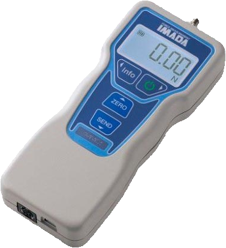
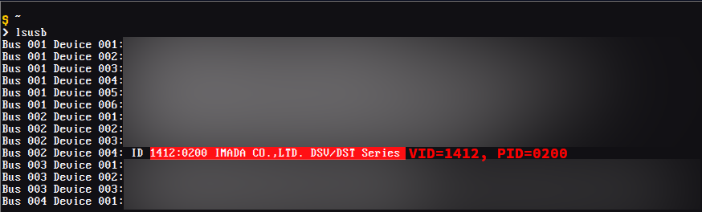

# Python module to access to Imada DST/DSV series devices

[](https://pypi.org/project/dstdsv)
[](https://pypi.org/project/dstdsv)

- Florian Dupeyron &lt;florian.dupeyron&lt;at&gt;mugcat.fr&gt;
- July 2024

-----

This is a simple python library that allows to pilot an imada DST/DSV series force gauge.



The following basic features are implemented:

- Get a measure
- Reset the measurement
- Set measure mode (Realtime / Peak)
- Set the measure unit (Newton / Kilograms)
- Set limit points (above and below limits)
- Store last measure in memory
- Clear last stored measure in memory
- Clear all stored measures
- Turn off the device


## Installation

```console
pip install dstdsv
```

This package depends on `pyserial` to handle serial communication.


## Test your setup

To test your setup, two utility scripts are available:

- `dstdsv.utils.list_devices`: List compatible devices found on PC (when connected using USB cable);
- `dstdsv.utils.test_measure`: Test 10 measures on first found compatible devices

For instance, on my linux machine:

```
> python -m dstdsv.utils.list_devices
Found compatible devices:
- /dev/ttyUSB3: DSV/DST Series - DSV/DST Series
```

```
> hatch run python -m dstdsv.utils.test_measure
Measured data [Decimal('0.00'), Decimal('0.00'), Decimal('0.00'), Decimal('0.00'), Decimal('0.00'), Decimal('0.00'), Decimal('0.00'), Decimal('0.00'), Decimal('0.00'), Decimal('0.00')]
```


## Basic usage

Two top level calsses are available to access the device, according to used link type :

- `GaugeUSBDevice` when the device is linked using USB ;
- `GaugeSerialDevice` when the device is linked using RS232C Connector.

Here is a basic example that does 10 measurements, each 100ms :

```python
from dstdsv import (
    GaugeUSBDevice,
    GaugeMeasureMode,
    GaugeMeasureUnit
)

import time

SERIAL_DEVICE = "COM23" # Path to serial device


if __name__ == "__main__":
    with GaugeUSBDevice(SERIAL_DEVICE) as gauge:
        # Initial setup
        gauge.unit_set(GaugeMeasureUnit.Newton)
        gauge.mode_set(GaugeMeasureMode.Realtime)

        # Do 10 measures
        measures = []
        for i in range(10):
            curtime = time.time()
            nexttime = curtime + 0.1 # Time to next measure

            measure = gauge.measure()
            measures.append(measure.value)

            time.sleep(nexttime-time.time()) # Sleep until next measure time
```


Optionally, the `dstdsv.find_devices()` function can be used to find compatible devices:

```python
from dstdsv import (
    GaugeUSBDevice,
    GaugeMeasureMode,
    GaugeMeasureUnit,
)

import time

if __name__ == "__main__":
    # Find compatible devices
    devices = find_devices()

    if not devices: # If list is empty, raise an error
        raise RuntimeError("Found no compatible device")

    selected_dev, selected_dev_description = devices[0] # Select the first found device

    print(f"- Use found device at {selected_dev}: {selected_dev_description}")

    with GaugeUSBDevice(selected_dev) as gauge:
        # Initial setup
        gauge.unit_set(GaugeMeasureUnit.Newton)
        gauge.mode_set(GaugeMeasureMode.Realtime)

        # Do 10 Measures
        measures = []
        for i in range(10):
            curtime = time.time()
            nexttime = curtime + 0.1

            measure = gauge.measure()
            measures.append(measure.value)

            time.sleep(nexttime-time.time()) # Sleep until next measure time
```


## Note for linux users

By default, the device shall not be recognized by a linux system. But as the devices uses a FTDI-X chip to implement the USB/serial ink, the `ftdi_sio` driver can be used to access the device, which should be available on most linux systems.

First, identify the VID/PID of the device using the `lsusb` command:



For DST/DSV devices, tthe VID should be `1412`, and the PID should be `0200`.

Next, you need to load the `ftdi_sio` module (as root):

```
# modprobe ftdi_sio
```

Next, you can register the VID/PID using the following command (as root):

```
# echo <VID> <PID> > /sys/bus/usb-serial/drivers/ftdi_sio/new_id
```

For example, in our case:

```
# echo 1412 0200 > /sys/bus/usb-serial/drivers/ftdi_sio/new_id
```


After that, we can verify in the kernel logs (using the `dmesg` command), that our device has been recognized:

```
[ 5351.072861] usb 2-1.8.2: new full-speed USB device number 4 using ehci-pci
[ 5351.179497] usb 2-1.8.2: New USB device found, idVendor=1412, idProduct=0200, bcdDevice=10.00
[ 5351.179519] usb 2-1.8.2: New USB device strings: Mfr=1, Product=2, SerialNumber=3
[ 5351.179532] usb 2-1.8.2: Product: DSV/DST Series
[ 5351.179534] usb 2-1.8.2: Manufacturer: IMADA CO.,LTD.
[ 5351.179536] usb 2-1.8.2: SerialNumber: DS31ODMQD
[ 5735.295799] usbcore: registered new interface driver ftdi_sio
[ 5735.295819] usbserial: USB Serial support registered for FTDI USB Serial Device
[ 5927.406465] ftdi_sio 2-1.8.2:1.0: FTDI USB Serial Device converter detected
[ 5927.406555] usb 2-1.8.2: Detected FT-X
[ 5927.407719] usb 2-1.8.2: FTDI USB Serial Device converter now attached to ttyUSB3
```

It's a win! The device has been recognized and attached to device `/dev/ttyUSB3`. It shall also be available
in `/dev/serial/by-id/ usb-IMADA_CO._LTD._DSV_DST_Series_<SERIAL_NUMBER>-if00-port0`.

Now, please note that after reboot, this configuration will be lost. To make it permanent, the best is to create an `udev` rule that triggers those commands when the device is plugged in.

Create the `/etc/udev/rules.d/80-imada_dstdsv.rule` file with the following content:

```
ACTION=="add", ATTRS{idVendor}=="1412", ATTRS{idProduct}=="0200", RUN+="/sbin/modprobe ftdi_sio" RUN+="/bin/sh -c 'echo 1412 0200 > /sys/bus/usb-serial/drivers/ftdi_sio/new_id'"
```

After that, reload the udev rules:

```
# udevadm control --reload
```

Optionally, you can trigger the rules:

```
# udevadm trigger
```

_cf._ https://stackoverflow.com/questions/442833/how-to-force-driver-to-device-match-in-linux for more info.


## TODO

- [ ] Create an `async` variant using `pyserial-asyncio`


## License

`dstdsv` is distributed under the terms of the [MIT](https://spdx.org/licenses/MIT.html) license.


